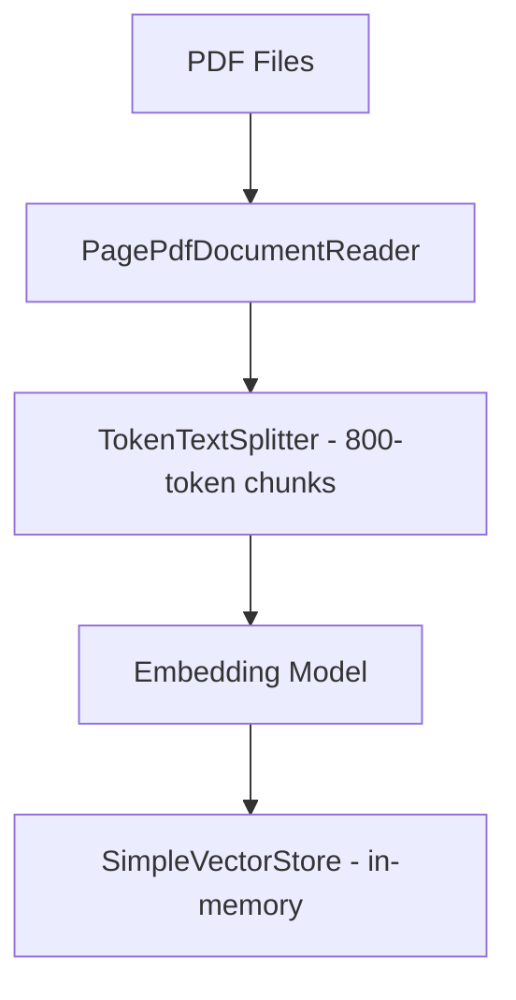
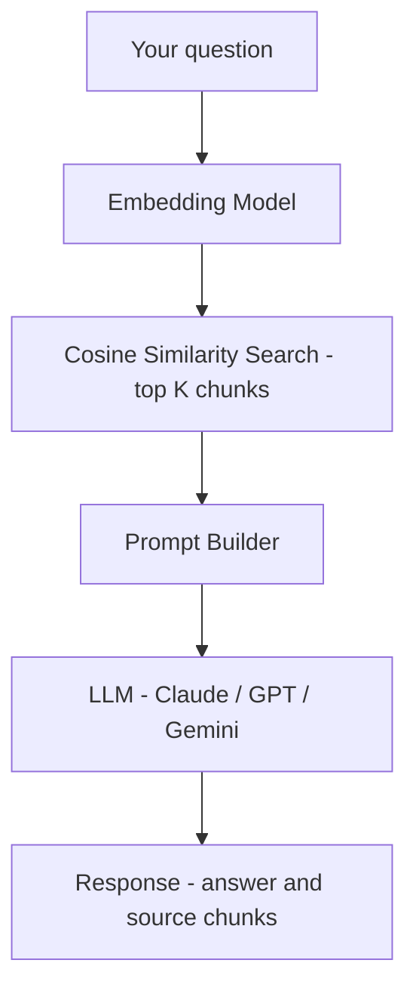
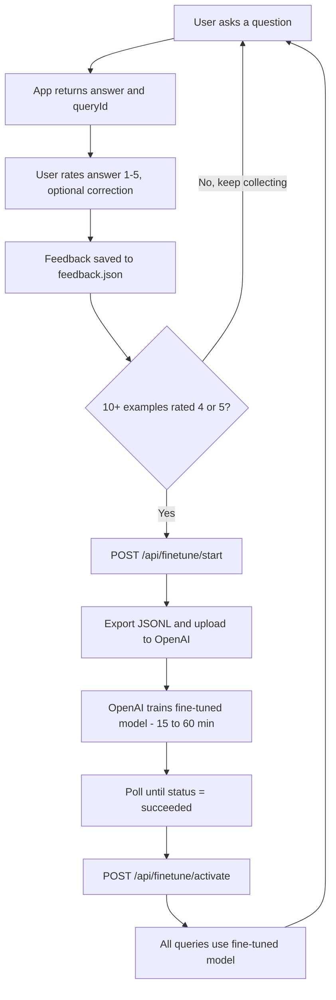

# Document Summarization and Semantic Search

A Spring Boot application that lets you drop PDF files into a folder, index them with one API call, and then ask questions about them in plain English. It finds the most relevant sections using vector search and feeds them to an LLM to generate a grounded, cited answer.

You can swap between Anthropic (Claude), OpenAI (GPT), or Google Gemini by changing two lines in `application.yml`. No code changes needed.

---

## What problem does this solve

Reading through long PDFs to find specific information is slow. This app lets you ask a question like "What are the key risks mentioned in section 3?" and get a direct answer with references to which file and which section it came from. It works across multiple PDFs at once, so you can ask a question that spans several documents and it will pull from whichever ones are relevant.

The technique it uses is called Retrieval-Augmented Generation (RAG). Instead of sending the entire PDF to the LLM (which would be expensive and often impossible due to context limits), it first finds only the relevant excerpts using vector similarity search, then sends just those excerpts to the model along with your question. This keeps costs low and makes the answers more focused.

---

## How the RAG pipeline works

There are two distinct phases: ingestion (happens once) and querying (happens every time you ask a question).

### Phase 1 - Ingestion



When you call `POST /api/documents/ingest`, the app scans the files directory for all PDFs, reads each one, splits the text into chunks, generates an embedding vector for each chunk, and stores everything in memory. The vectors are lost when the app restarts, so you need to call ingest again after each restart.

A `ReentrantLock` prevents two concurrent ingest calls from running at the same time. If you call ingest while one is already running, it returns immediately with a message telling you to wait.

Each chunk carries metadata like `source_file` so answers can cite where they came from.

### Phase 2 - Querying



When you call `POST /api/query`, the app embeds your question, runs a similarity search (filtering out chunks below the `similarity-threshold`), builds a prompt with those chunks as context, calls the LLM, and returns the answer along with the source chunks. Every response includes a `queryId` that you use when submitting feedback.

### Why this works better than sending the whole PDF

Vector similarity search finds chunks that are semantically similar to your question, not just keyword matches. If you ask "What are the risks?", it will find chunks talking about "potential downsides", "challenges", or "concerns" even if those exact words are not in your question. The LLM then gets only the relevant parts rather than hundreds of pages.

---

## Prerequisites

- Java 21 or higher
- Maven (or use the included `mvnw` wrapper)
- An API key for at least one provider (see the Provider Comparison section below)

---

## Setup

### 1. Configure providers

Open `application.yml` and set which provider you want to use for chat and for embeddings:

```yaml
app:
  chat-provider:  openai   # anthropic | openai | gemini
  embed-provider: openai   # openai | gemini
```

Note that Anthropic does not offer an embedding API, so if you use Claude for chat you still need either an OpenAI or Gemini key for embeddings.

### 2. Set your API keys in .env

The project uses a `.env` file at the root level to store API keys. Open it and fill in the key for whichever provider you chose:

```
ANTHROPIC_API_KEY=your_anthropic_key_here
OPENAI_API_KEY=your_openai_key_here
GOOGLE_API_KEY=your_google_key_here
```

You only need to fill in the key for the provider you are actually using. The app throws a clear error at startup if a required key is missing.

The `.env` file is listed in `.gitignore` so it will never be accidentally committed.

### 3. Add your PDF files

Copy your PDF files into:

```
src/main/resources/files/
```

The app scans this folder automatically when you call the ingest endpoint.

### 4. Start the app

```bash
./mvnw spring-boot:run
```

The server starts on port 9999.

### 5. Ingest your documents

```bash
curl -X POST http://localhost:9999/api/documents/ingest
```

This reads all PDFs, chunks them, generates embeddings, and stores the vectors in memory. Call this once after every startup.

### 6. Start asking questions

```bash
curl -X POST http://localhost:9999/api/query \
  -H "Content-Type: application/json" \
  -d '{"question": "What are the main findings?"}'
```

---

## Health and metrics

The app exposes Spring Boot Actuator endpoints for monitoring.

### Health check

```bash
curl http://localhost:9999/actuator/health
```

Returns `{"status":"UP"}` when the app is ready.

### Prometheus metrics

```bash
curl http://localhost:9999/actuator/prometheus
```

Custom metrics tracked:

| Metric | Type | Description |
|---|---|---|
| `query.latency` | Timer | Total time per query, tagged with `result` (success/empty) |
| `retrieval.latency` | Timer | Time spent on vector similarity search |
| `llm.latency` | Timer | Time spent waiting for the LLM, tagged with `attempt` number |
| `query.success` | Counter | Number of successful queries |
| `query.empty_results` | Counter | Queries that returned no matching chunks |
| `llm.rate_limit_hits` | Counter | Number of times rate limit retry was triggered |
| `ingestion.files.total` | Counter | Total PDF files ingested across all runs |
| `ingestion.chunks.total` | Counter | Total chunks embedded across all runs |

---

## Correlation IDs

Every request is assigned a correlation ID. If the request includes an `X-Correlation-Id` header, that value is used. Otherwise a UUID is generated automatically.

The correlation ID appears in:
- Every log line for that request (via MDC)
- The `X-Correlation-Id` response header
- Error responses from the exception handler

This makes it straightforward to trace a specific request through the logs:

```bash
curl -H "X-Correlation-Id: my-debug-request" \
  -X POST http://localhost:9999/api/query \
  -H "Content-Type: application/json" \
  -d '{"question": "What is this document about?"}'

# Then in the logs you will see:
# [my-debug-request] INFO QueryService - Query | queryId=... topK=5 question=...
```

---

## API reference

### POST /api/documents/ingest

Scans the files directory for PDFs, chunks them, generates embeddings, and stores the vectors. Call this once per app startup before making any queries.

**Response:**
```json
{
  "success": true,
  "ingestedFiles": ["transformer-architecture.pdf", "AI_Concepts_Guide.pdf"],
  "totalChunks": 47,
  "message": "Ingested 2 file(s)."
}
```

If a file fails (corrupted PDF, parse error), it is skipped and listed in the message. If the embedding API rate limit is hit, the request fails immediately with a 429 and a descriptive error message.

---

### POST /api/query

Runs a semantic search over the ingested documents and generates a grounded answer.

**Request body:**

| Field | Type | Required | Default | Description |
|---|---|---|---|---|
| `question` | string | yes | - | The question to ask (max 2000 characters) |
| `topK` | integer | no | 5 | How many chunks to retrieve and use as context |

**Example request:**
```json
{
  "question": "How does multi-head attention work?",
  "topK": 5
}
```

**Example response:**
```json
{
  "queryId": "a3f7c2d1-8b4e-4f9a-bc12-1234567890ab",
  "answer": "Multi-head attention works by running multiple attention functions in parallel...",
  "sources": [
    {
      "content": "Multi-head attention allows the model to jointly attend to information...",
      "sourceFile": "transformer-architecture.pdf",
      "metadata": {
        "page_number": 4,
        "source_file": "transformer-architecture.pdf"
      }
    }
  ]
}
```

The `queryId` is used when submitting feedback. The `sources` array lists every chunk that was sent to the LLM so you can verify where the answer came from.

---

### GET /api/documents/list

Returns a list of all PDF files currently in the files directory, regardless of whether they have been ingested yet.

---

### GET /api/documents/status

Returns the current state of the vector store.

**Response:**
```json
{
  "ingested": true,
  "ingesting": false,
  "ingestedFiles": ["transformer-architecture.pdf"],
  "totalChunks": 24
}
```

---

## Fine-tuning

### Why the base model is not always enough

A general-purpose model like GPT-4o-mini has never seen your specific documents, your organization's terminology, or the particular way you need answers formatted. RAG gets you most of the way there by providing relevant context, but the model still has to figure out the right tone, the right level of detail, and how to correctly interpret domain-specific language from the context alone.

Fine-tuning closes that gap. You collect real queries and their ideal answers over time, then use that data to train a specialized version of the model. The fine-tuned model learns your domain vocabulary, the answer format you expect, and how to use the retrieved context effectively.

### How the fine-tuning loop works



### Step-by-step guide

**Step 1: Ask questions and collect the queryIds**

Every query response includes a `queryId` field. Save this ID because you need it to submit feedback.

```bash
curl -X POST http://localhost:9999/api/query \
  -H "Content-Type: application/json" \
  -d '{"question": "What is the attention mechanism?"}'

# Response includes:
# "queryId": "a3f7c2d1-8b4e-4f9a-bc12-1234567890ab"
```

**Step 2: Rate answers and submit feedback**

After reading the answer, rate it from 1 to 5. If the answer was wrong or incomplete, include a corrected version.

```bash
curl -X POST http://localhost:9999/api/feedback \
  -H "Content-Type: application/json" \
  -d '{
    "queryId": "a3f7c2d1-8b4e-4f9a-bc12-1234567890ab",
    "rating": 5
  }'

# If the answer needed improvement:
curl -X POST http://localhost:9999/api/feedback \
  -H "Content-Type: application/json" \
  -d '{
    "queryId": "a3f7c2d1-8b4e-4f9a-bc12-1234567890ab",
    "rating": 2,
    "correctedAnswer": "The attention mechanism works by computing a weighted sum of values..."
  }'
```

Ratings of 4 and 5 are used for training. Ratings of 1 to 3 are stored but excluded by default.

```bash
# See all feedback
curl http://localhost:9999/api/feedback

# See only high-rated feedback (eligible for training)
curl "http://localhost:9999/api/feedback?minRating=4"

# See a summary with counts and average rating
curl http://localhost:9999/api/feedback/summary
```

**Step 3: Check how many training examples you have**

OpenAI requires a minimum of 10 training examples. Check the count before starting a job:

```bash
curl http://localhost:9999/api/finetune/status

# Response:
# {
#   "overrideActive": false,
#   "activeModelId": "none (using base model)",
#   "chatProvider": "openai",
#   "eligibleExamples": 23
# }
```

You can also preview exactly what will be sent to OpenAI by downloading the training file first:

```bash
curl "http://localhost:9999/api/finetune/export?minRating=4" \
  --output training-preview.jsonl

cat training-preview.jsonl
```

**Step 4: Start a fine-tuning job**

```bash
curl -X POST http://localhost:9999/api/finetune/start \
  -H "Content-Type: application/json" \
  -d '{
    "minRating": 4,
    "baseModel": "gpt-4o-mini-2024-07-18",
    "suffix": "my-docs-v1"
  }'

# Response:
# {
#   "jobId": "ftjob-abc123xyz",
#   "status": "validating_files",
#   "baseModel": "gpt-4o-mini-2024-07-18",
#   "fineTunedModel": null,
#   "trainingFileId": "file-xyz789",
#   "createdAt": "2025-01-15T10:30:00Z"
# }
```

Training happens asynchronously on OpenAI's side and typically takes 15 minutes to a few hours.

**Step 5: Monitor the job until it finishes**

```bash
curl http://localhost:9999/api/finetune/jobs/ftjob-abc123xyz

# Keep checking until status = "succeeded"
# At that point, fineTunedModel will have a value like:
# "fineTunedModel": "ft:gpt-4o-mini-2024-07-18:your-org:my-docs-v1:abc123"
```

**Step 6: Activate the fine-tuned model**

Once the job shows `"succeeded"`, copy the `fineTunedModel` ID and activate it. All queries from this point forward use the fine-tuned model.

```bash
curl -X POST http://localhost:9999/api/finetune/activate \
  -H "Content-Type: application/json" \
  -d '{"modelId": "ft:gpt-4o-mini-2024-07-18:your-org:my-docs-v1:abc123"}'
```

No restart needed. The model switch happens live. To revert back to the base model:

```bash
curl -X DELETE http://localhost:9999/api/finetune/activate
```

### Why fine-tuning gives more accurate results

**Domain vocabulary.** If your documents use specialized terms that a general model might misinterpret, a fine-tuned model learns what those terms mean in your context.

**Handling context correctly.** A base model does not always prioritize the retrieved context over its general training knowledge. A fine-tuned model has been trained specifically on examples where good answers came from reading the provided context, so it learns to rely on it.

**Consistent answer format.** If you want answers in a specific structure (bullet points, summaries, numbered steps), the corrected answers you provide during feedback teach the model exactly what format you prefer.

**Fewer hallucinations.** A fine-tuned model that has seen many examples of "I don't have enough information from the provided context" learns that saying so is the right behavior.

**Better use of corrections.** When you provide a corrected answer for a low-rated response, that correction becomes a training example. Over multiple training runs, the model gets systematically better on exactly the kinds of questions your users ask.

### Important notes about fine-tuning

Fine-tuning only works when `app.chat-provider` is set to `openai`. You need an OpenAI API key even if you are using Anthropic or Gemini for regular queries.

OpenAI charges for fine-tuning based on training tokens. A dataset of 50 examples averages roughly $0.10 to $0.30 for gpt-4o-mini. Check OpenAI's pricing page for current rates.

Feedback is saved to `feedback.json` and survives restarts. The model override set via `/api/finetune/activate` does not survive restarts. After a restart, call `/api/finetune/activate` again with the same model ID.

---

## Fine-tuning API reference

### POST /api/feedback

Submits feedback on a query response.

| Field | Type | Required | Description |
|---|---|---|---|
| `queryId` | string | yes | The queryId from the query response |
| `rating` | integer | yes | Score from 1 (bad) to 5 (perfect) |
| `correctedAnswer` | string | no | A better answer to use as the training target |

---

### GET /api/feedback

Lists all stored feedback. Pass `?minRating=4` to filter to training-eligible entries only.

---

### GET /api/feedback/summary

Returns counts and averages across all collected feedback.

```json
{
  "total": 47,
  "averageRating": 3.8,
  "ratingDistribution": { "1": 3, "2": 5, "3": 8, "4": 18, "5": 13 },
  "eligibleForTraining": 31
}
```

---

### DELETE /api/feedback/{id}

Removes a specific feedback entry from the store and from `feedback.json`.

---

### POST /api/finetune/start

Exports eligible feedback as JSONL, uploads it to OpenAI, and starts a fine-tuning job.

| Field | Type | Required | Default | Description |
|---|---|---|---|---|
| `minRating` | integer | no | 4 | Minimum rating to include in training |
| `baseModel` | string | no | gpt-4o-mini-2024-07-18 | Base model to fine-tune from |
| `suffix` | string | no | none | Optional label appended to the model name |

---

### GET /api/finetune/jobs

Lists the 20 most recent fine-tuning jobs.

---

### GET /api/finetune/jobs/{jobId}

Returns the current status of a specific job. Poll this until `status` is `"succeeded"` or `"failed"`.

---

### POST /api/finetune/jobs/{jobId}/cancel

Cancels a job that is still running.

---

### GET /api/finetune/export

Downloads the training data as a `.jsonl` file without starting a job. Useful for previewing what would be sent to OpenAI.

| Param | Default | Description |
|---|---|---|
| `minRating` | 4 | Minimum rating to include |

---

### POST /api/finetune/activate

Activates a fine-tuned model for all subsequent queries. No restart needed.

```json
{ "modelId": "ft:gpt-4o-mini-2024-07-18:your-org:suffix:abc123" }
```

---

### DELETE /api/finetune/activate

Reverts all queries back to the base model.

---

### GET /api/finetune/status

Shows which model is currently active, how many eligible training examples exist, and which chat provider is configured.

---

## Configuration reference

All configuration lives in `src/main/resources/application.yml`.

```yaml
app:
  chat-provider: openai       # anthropic | openai | gemini
  embed-provider: openai      # openai | gemini (anthropic has no embedding API)

  feedback:
    file: feedback.json       # where to persist feedback (relative path, or absolute)

  finetune:
    base-model: gpt-4o-mini-2024-07-18
    min-rating: 4

document:
  files-path: classpath*:files/   # where to look for PDFs
  chunk-size: 800                 # tokens per chunk (affects retrieval granularity)
  top-k: 5                        # default number of chunks to retrieve per query
  max-context-chars: 12000        # max characters of context sent to the LLM per query
  similarity-threshold: 0.70      # minimum cosine similarity to include a chunk

server:
  port: 9999
```

### Chunk size

Smaller chunks (300-500 tokens) give more precise retrieval but less context per chunk. Larger chunks (1000-1500 tokens) give more context but retrieval may be less focused. 800 is a reasonable default. If you change this, restart the app and re-ingest.

### Similarity threshold

The default of 0.70 filters out loosely related chunks. Raise to 0.80 or higher if you are getting irrelevant results in your answers. Lower it if the app frequently says "no relevant content found" even when the documents clearly contain the answer.

### Context window limit

`max-context-chars` controls how much text from retrieved chunks is sent to the LLM. 12000 characters is roughly 3000 tokens, which is well within the limits of all supported models. Increase this if you have a large `topK` and want the LLM to see more of each chunk.

### Using an external files folder

By default the app reads from `src/main/resources/files/` which is bundled into the JAR. To point it at a folder outside the project:

```yaml
document:
  files-path: file:/Users/yourname/documents/pdfs/
```

### Persisting vectors across restarts

The default `SimpleVectorStore` is in-memory and resets on every restart. To persist vectors to disk, update `AIConfig.java`:

```java
return SimpleVectorStore.builder(embedding)
        .storageFile(new java.io.File("vector-store.json"))
        .build();
```

---

## Provider comparison

| Chat provider | Embed provider | Keys needed | Rough cost per query | Notes |
|---|---|---|---|---|
| openai | openai | OPENAI_API_KEY | ~$0.001 | Cheapest, one key covers both |
| anthropic | openai | Both keys | ~$0.004 | Better answer quality |
| gemini | gemini | GOOGLE_API_KEY | Free tier | Shared quota, see below |
| anthropic | gemini | Both keys | ~$0.003 | Claude answers, free embeddings |

### Gemini free tier quota

The free tier for Gemini allows 15 requests per minute and 1500 requests per day. `gemini-embedding-001` counts against the same quota as `gemini-2.0-flash`. When you ingest a large PDF, the app sends one embedding request per chunk and can hit the per-minute limit quickly.

The app handles this with automatic retry and exponential backoff (up to 4 retries with delays of 10s, 20s, 40s, 60s). If the daily limit is exhausted, switch to `embed-provider: openai` in `application.yml` and restart.

---

## Project structure

```
src/
  main/
    java/com/example/summarize/
      config/
        AIConfig.java                 picks and wires the chat and embed providers at startup
        OpenAiRestClientConfig.java   RestClient bean used for OpenAI fine-tuning API calls
      controller/
        DocumentController.java       handles /api/documents/* endpoints
        QueryController.java          handles /api/query
        FeedbackController.java       handles /api/feedback/* endpoints
        FineTuningController.java     handles /api/finetune/* endpoints
        GlobalExceptionHandler.java   turns exceptions into proper HTTP responses
      filter/
        CorrelationIdFilter.java      injects X-Correlation-Id into MDC and response headers
      model/
        QueryRequest.java
        QueryResponse.java            includes queryId, answer, and source chunks
        QueryCacheEntry.java          in-memory cache entry (question, context, answer)
        SourceChunk.java              one retrieved chunk with metadata
        IngestResponse.java
        FeedbackRequest.java
        FeedbackEntry.java            stored feedback record (persisted to feedback.json)
        FeedbackResponse.java
        FineTuneRequest.java
        FineTuneStatusResponse.java
        ActivateModelRequest.java
      service/
        DocumentIngestionService.java reads PDFs, chunks them, stores embeddings
        QueryService.java             runs similarity search, calls the LLM, caches queries
        QueryCacheService.java        bounded in-memory cache of the last 1000 queries
        FeedbackService.java          stores feedback in memory, persists to feedback.json
        TrainingDataService.java      exports feedback as OpenAI fine-tuning JSONL
        FineTuningService.java        calls OpenAI file upload and fine-tuning APIs
        ModelOverrideHolder.java      thread-safe holder for the active fine-tuned model ID
    resources/
      application.yml
      files/                          drop your PDFs here
  test/
    java/com/example/summarize/
      SummarizeDocumentApplicationTests.java

feedback.json                         feedback persisted across restarts (created at runtime)
.env                                  API keys (never committed)
```

---

## Troubleshooting

**"No PDF files found"**
The files directory is empty or the path is wrong. Check that your PDFs are in `src/main/resources/files/` and that `document.files-path` in `application.yml` is set correctly.

**"Provider X is selected but spring.ai.X.api-key is not set"**
Open `.env` at the project root and fill in the API key for the provider you selected.

**429 rate limit errors during ingest**
You hit the per-minute limit on the embedding API. If you are using Gemini, the app retries automatically. If retries are exhausted or you hit the daily limit, switch `embed-provider` to `openai` in `application.yml`.

**"No relevant content found"**
The vector store is empty or the similarity threshold is too high. Call `POST /api/documents/ingest` first. If documents are ingested but queries still return nothing, try lowering `document.similarity-threshold` to 0.60 in `application.yml`.

**Answers seem wrong or hallucinated**
Check the `sources` array in the response to see which chunks were actually sent to the LLM. If the relevant information is not in those chunks, try increasing `topK` in your request (e.g. `"topK": 10`).

**Vectors lost after restart**
Expected behavior. The in-memory vector store does not persist to disk by default. Call `/api/documents/ingest` again after each restart, or configure a storage file as described in the Configuration section.

**"Query not found for id" when submitting feedback**
The query cache holds the last 1000 queries in memory and is cleared on restart. If the server was restarted since you made the query, the queryId is no longer available. Make the query again and submit feedback before the next restart.

**"Not enough training examples" when starting a fine-tune job**
You need at least 10 feedback entries with a rating of 4 or 5. Check the count at `GET /api/finetune/status`.

**"OPENAI_API_KEY is required for fine-tuning"**
Fine-tuning always uses OpenAI's API regardless of which chat provider you use for regular queries. Set `OPENAI_API_KEY` in your `.env` file.

**"Model override only works when app.chat-provider=openai"**
Fine-tuned models are OpenAI models and can only be used when the chat provider is openai. If you are using Anthropic or Gemini for chat, switch `app.chat-provider` to `openai` first.

**Fine-tuned model override lost after restart**
The model override is stored in memory. After restarting, call `POST /api/finetune/activate` again with your model ID.

**Fine-tuning job shows status "failed"**
Check the `error` field in the job status response. Common causes: fewer than 10 valid training examples, incorrect base model name, or OpenAI account hit a fine-tuning quota.

---

## Things worth knowing

Re-ingesting the same files adds duplicate chunks because the app does not check for existing entries before inserting. If you need to re-ingest (because you changed a file or the chunk size), restart the app first to clear the store, then call `/ingest` again.

The LLM only sees the chunks retrieved by the similarity search. If your question is about something not in the indexed PDFs, the model says it does not have enough information rather than guessing. This is controlled by the system prompt.

The `topK` parameter controls how many chunks are retrieved per query. Higher values give the LLM more context but increase token cost. The default of 5 works well for most questions. For broad summary questions, try 8-10.

All requests include a correlation ID in the logs (via MDC) and in the `X-Correlation-Id` response header. When reporting a bug or investigating an unexpected response, include this ID so you can find the exact request in the logs.
